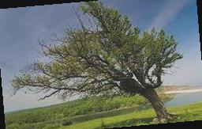

# 
 Image Handling with Filters and Frequencies 

 <a href = https://inst.eecs.berkeley.edu/~cs194-26/fa20/hw/proj2/> CS194-26 Proj #2 </a>: Fun with Filters and Frequencies, Ken Guan 

&nbsp;

## Background
How much information does an image contain? While we are already familiar with the semantics of raw pixels, this project demonstrates a few ways to extract more information: convolutions, gradients, filters, and Fourier domain transform. Each section below corresponds to a task in the original project (linked above).

&nbsp;

## Edge Detection with Gradient
First, we use a simple gradient method for edge detection. We convolve the image with two 1D vectors: 

; 

We then binarize the gradient image with a threshold on magnitude. With some trials and errors, threshold=0.15 produced the edge image below.

From left to right: Original image, image * Dx, image * Dy, binary gradient image.

&nbsp;

## Edge Detection and Gaussian Blur
To remove the noise edges detected (see the tiny white dots toward the bottom?), we apply a Gaussian smooth before running gradient edge detection.

By comparison, the detected edges become significantly wider after Gaussian Blur. There's also much fewer noise pixels. Note that since convolution is a linear operator, one can combine the two convolution operations into one. Below are the Derivative of Gaussian (DoG) filters, applying which on the original image yields the exact same result.

&nbsp;

## Image Straightening

We are now equipped with all the tools perform edge detection on any image. An interesting use case of edge detection is image straightening, where one could collect information about angles of edges in an image then rotate to maximize number of horizontal/vertical edges. Below are my results and their corresponding histogram of angle of edges:

 &nbsp; &nbsp; &nbsp; &nbsp; &nbsp; &nbsp; 

 &nbsp; &nbsp; &nbsp; &nbsp; &nbsp; &nbsp; 

&nbsp;

 &nbsp; &nbsp; &nbsp; &nbsp; &nbsp; &nbsp; 

 &nbsp; &nbsp; &nbsp; &nbsp; &nbsp; &nbsp; 

&nbsp;

 &nbsp; &nbsp; &nbsp; &nbsp; &nbsp; &nbsp; 

 &nbsp; &nbsp; &nbsp; &nbsp; &nbsp; &nbsp; 

&nbsp;

 &nbsp; &nbsp; &nbsp; &nbsp; &nbsp; &nbsp; 

 &nbsp; &nbsp; &nbsp; &nbsp; &nbsp; &nbsp; 

&nbsp;

One can see that, by rotating an image, we shift the histogram. The first two images are nicely aligned to maximize the number of vertical and horizontal edges (which correspond to -&pi;/2, 0, &pi;/2 in the histogram). The third also worked due to a large number of edges at -&pi;/2, but the 4th image is completely wrecked because the distribution of edges look mostly random, rahter than centered around stright angles.

&nbsp;

## Image Sharpening

Image Sharpening is a technique that emphasizes the high frequency portions of the image. We do so by adding to the image another layer of high frequency content, which we obtain from subtracting the low frequency layer from the image.

 &nbsp; &nbsp; &nbsp; &nbsp; &nbsp; &nbsp; 

 &nbsp; &nbsp; &nbsp; &nbsp; &nbsp; &nbsp; 

 &nbsp; &nbsp; &nbsp; &nbsp; &nbsp; &nbsp;  &nbsp; &nbsp; &nbsp; &nbsp; &nbsp; &nbsp; 

Both sharpening are done with &alpha; = 1. That is: f = f + &alpha;(f - f * G) = f(2I - G). Note that the edges of the images are standing out more, while the low frequency portions are relatively dimmer.

Note that for the image which was blurred then sharpened, the high-frequency details were still lost in the transition. Image sharpening never increases the amount of information.

&nbsp;

## Hybrid Images

This part uses a blending technique introduced by <a href = http://olivalab.mit.edu/publications/OlivaTorralb_Hybrid_Siggraph06.pdf> Olivia et al. (2006) </a>. We stack high frequency content from one image and low frequency content from another to produce different views at different distances.

 &nbsp; 

  &nbsp; 

 &nbsp;  

 

 &nbsp; 

 &nbsp; 

&nbsp;

Some other examples: 

 &nbsp;  &nbsp; 

&nbsp;

 &nbsp;  &nbsp; 

Note that the last example, where the squirtle (right) is on high frequency and the blastoise (left) on low, the combination is not as good because a bunch of low frequency features interfere with close-distance views, and that the high frequency seems to dominate even at far distance.

&nbsp;

## Gaussian and Laplacian Stack

Gaussian/Laplacian Stack is a technique that decomposes an image into different frequency bands. (Approximately &sigma; = 2, 4, 8, 16)

 

 

&nbsp;

## Multiresolution Blending

Finally! In this part we blend up 2 images by blending them on multiple frequency bands.

 &nbsp;  &nbsp; 

&nbsp;

 &nbsp;  &nbsp; 

In the last blend of a hamster (left) and a guinea pig (right), we used a special Sigmoid mask which gives a non-linear blend.

  

&nbsp;

  

&nbsp;

  

&nbsp;

  

&nbsp;

  

&nbsp;